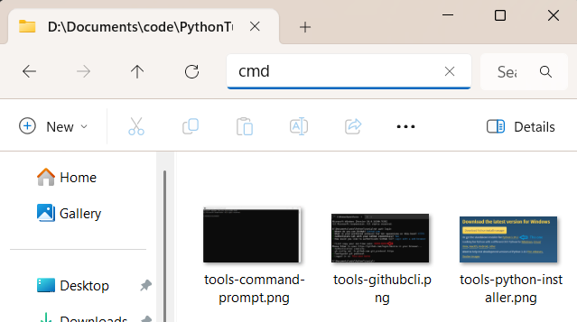
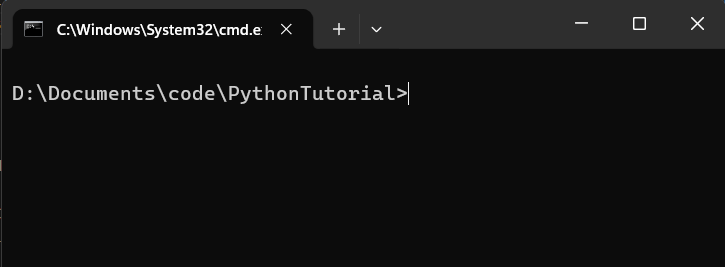

This file will explain the details of installing the required tools (Python, Git, VSCode) 
and an introduction for how to use each for this tutorial.

## Python

Install Python using the standalone installer from the latest official download page https://www.python.org/downloads/

Make sure that python gets added to the PATH

Run this command in a command prompt to ensure proper installation: python --version \
[Never used a command prompt before? Jump here!](#command-prompt) \
On some systems, you might need to use 'py' or 'python3' instead of 'python'. From now on in this tutorial, I will always use the 'python' command, remember to adjust if you need to use 'py' or 'python3' as your command.

To run the Python interpreter, run this command in a command prompt: python \
From there you can type and enter code to the interpreter and it will run it. \
To exit the interpreter and return to your command line, enter this: exit() \
Note that this will cause Python to forget all variables and functions you sent to it in that session.

## VSCode

VSCode is an Integrated Development Library, or IDE. This is not required, but is extremely useful. Another option you could look into is Jupyter Notebooks, which has more of a focus on data science but will not be covered here.

You can download the VSCode installer from the official download page https://code.visualstudio.com/download

After installing it, we will want to get some extensions that make Python easier to code and debug. Open VSCode and find and click on the icon labeled Extensions on the left side. Type 'python' in the search bar that appears and install the extension by microsoft. 

We will come back to this program once we have obtained the code. [Already have the code? Jump here!](#opening-editing-and-running-the-code) \

To open code in a file or folder, use the File button at the top of the window. Then on the sidebar, select Explorer if it is not already selected.

To run a Python script, use the Run & Debug button on the sidebar. If asked to choose how to run, select python debugger.

To run a single line or single block of code use [shift + enter] while your cursor is on the line in question.

## Git

Install git from the latest official download page https://git-scm.com/install/windows \
Install the GitHub CLI from the latest official download page https://cli.github.com/ \
Optionally, install tortoise git https://tortoisegit.org/download/ \
    Note that this tutorial does not cover tortoise git usage, but it may be more intuitive to use \
Check that git was installed correctly on a command line: git --version

Create a GitHub account https://github.com/

We're going to run a series of commands to set up Git with GitHub

This command will authenticate your access to GitHub on your current device. \
Command> gh auth login \
Follow the instructions and enter your GitHub credentials where necessary. Use the arrow keys or type 'y' or 'n' to select each option. The image below shows the options I recommend choosing. 

This command will help you configure git. \
I recommend using the same user name as your GitHub. \
Command> git config

If for some reason git config does not set a username and email, do these commands: \
Command> git config --global user.name "your_username" \
Command> git config --global user.email "your_email@example.com"

If you have any issues beyond this, try following this guide: https://docs.github.com/en/get-started/git-basics/set-up-git

In a command prompt, navigate to the folder you would like this tutorial to be placed and run this. \
Command> git clone https://github.com/Skyzeala/Python-Tutorial.git

Now your folder should contain everything from this tutorial.

If you need to update your copy of the code repository, use this command. \
Command> git pull \
Note that this will not work if you have made any changes to the code in the repository.

There are many other git commands, but the rest are outside the scope of this tutorial. \
You can find some help here: https://git-scm.com/cheat-sheet

Now you can start using the code within the modules of this tutorial. [Jump to how to open and run!](#opening-editing-and-running-the-code)

## Command Prompt

Command prompts offer direct access with the operating system and other programs via a text based interface. Many pograms are written for exclusive use on a command line, including python scripts, so it is useful to become comfortable with them. A command prompt on windows can be opened by searching "cmd" or "command prompt" in the search on a windows taskbar. Alternatively, a command prompt can also be opened with windows explorer by typing "cmd" in the path. As a side note, the command prompt we're using is not the same as powershell, we will not be covering powershell use in this tutorial.

Command prompts are localized to a directory (folder), and have direct access to the items within the directory. The default location is C:\Windows\System32, but you will typically want to work in the same directory as your code instead. The prompt part of the command prompt window typically shows what the working directory is. After the prompt is where you can type out commands, I've listed a few useful ones below with some examples of what they do.

Command> dir \
List items in the current directory. Similar to looking in a folder using Windows Explorer. You can see when each file was last edited, the size in bytes, and the type (file or directory). \
'.' is a reference to the current directory, and '..' is a reference to the parent directory. These references are useful for navigation or specifying local files and directories. For example, "./Images" is called the relative path to the Images folder of this tutorial, the full path would look something like "C:\Documents\code\PythonTutorial\Images", depending on where you placed your code.

Command> cd \
Change directory. After cd, type a path to a different directory. You can use relative paths (like ./subfolder). Running just 'cd' will print the full path of the current directory. To change drives (for example, change from OS drive C: to usb drive D:) use the command "D:", or whatever your drive label is, then you may change directories within that drive. \
Example> cd C:\Documents\code\PythonTutorial
Result: Your command prompt will now be working in the PythonTutorial directory
Example> cd ..
Result: Your command prompt will now be working in the parent directory of its previous working directory. If your previous working directory was C:\Documents\code\PythonTutorial, then your new current working directory will be C:\Documents\code.

Command> mkdir \
Make a new directory. After mkdir, type a name for your new directory.
Example> mkdir newFolder
Result: a new folder is made in the current directory called "newFolder"
Example> mkdir "New Folder"
Result: a new folder is made in the current directory called "New Folder". Note the use of quotes in the command, this is how to include a space in the folder name.

Command> type \
Display file as text. After type, type a filename for the file you want to print to the console. \
Example> type tools_tutorial.md \
Result: Display this file in plain text. If you're not familiar with markdown you may notice there are a lot of slashes and pound signs, these are for formatting.

Command> notepad.exe
Open the Windows notepad application. You can specify a file name after the notepad command to open a specific existing file, or create a new file to edit.
Example> notepad.exe new_text_file.txt
Result: Notepad would open with a new empty text file called new_text_file.txt stored in the current directory. 

Command> cls \
Command> [ctrl + shift + k] \
Clear screen. Clears the screen and starts a new prompt (>). You cannot retrieve any past input or output so use this carefully.

Command> [ctrl + c] \ 
Kills any active program in the prompt, including the prompt itself. Be careful when copying with keyboard shortcuts. The Python interpreter has a 'handler' for this, and will not close completely, but any script that was running would be forced to quit.

Command> help \
Get info on other commands. After help, type the command you want to know more about.

If you want to run a command you ran previously, you can use the arrow keys to bring up past entries. These can then be edited before running them again if you wish.

## Python Interpreter

In the python interpreter, the last output is stored in the variable '_', 
which you can use in your next statement.

## Opening, editing, and running the code

