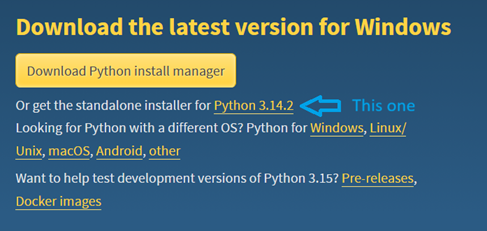
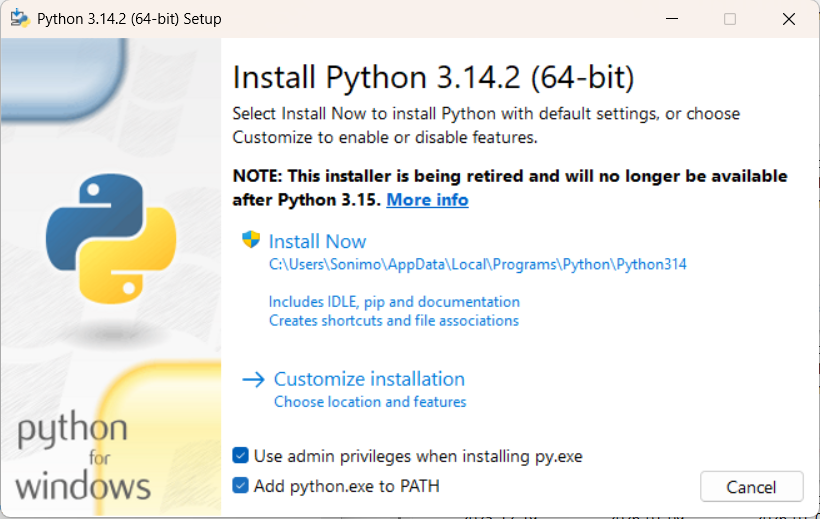
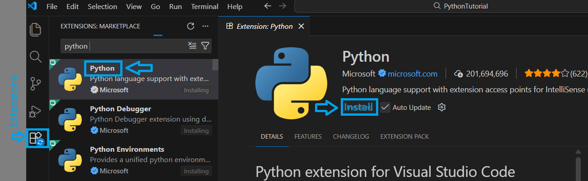
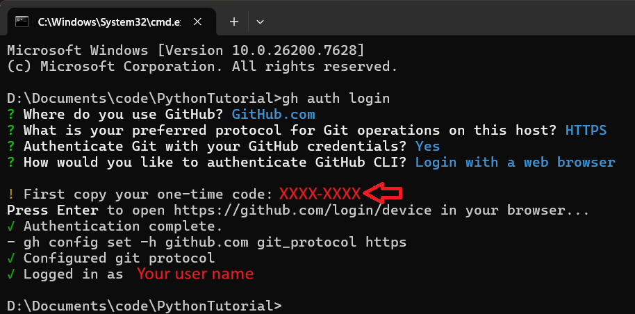

This file will explain the details of installing the required tools (Python, Git, VSCode) 
and an introduction for how to use each for this tutorial.

## Python

Install Python using the standalone installer from the latest official download page https://www.python.org/downloads/

Make sure that python gets added to the PATH

Run this command in a command prompt to ensure proper installation: python --version \
[Never used a command prompt before? Jump here!](#command-prompt) \
On some systems, you might need to use 'py' or 'python3' instead of python. From now on in this tutorial, I will always use the 'python' command, remember to adjust if you need to use 'py' or 'python3' as your command.

To run the Python interpreter, run this command in a command prompt: python \
From there you can type and send code to the interpreter and it will run it. \
To exit the interpreter and return to your command line, enter this: exit() \
Note that this will cause Python to forget all variables and functions you sent to it in that session.

## VSCode

VSCode is an Integrated Development Library, or IDE. This is not required, but is extremely useful. Another option you could look into is Jupyter Notebooks, which has more of a focus on data science but will not be covered here.

You can download the VSCode installer from the official download page https://code.visualstudio.com/download

After installing it, we will want to get some extensions that make Python easier to code and debug. Open VSCode and find and click on the icon labeled Extensions on the left side. Type 'python' in the search bar that appears and install the extension by microsoft. 

To open code in a file or folder, use the File button at the top of the window. Then on the sidebar, select Explorer if it is not already selected.

To run a Python script, use the Run & Debug button on the sidebar. If asked to choose how to run, select python debugger.

To run a single line or single block of code use [shift + enter] while your cursor is on the line in question.

## Git

Install git from the latest official download page https://git-scm.com/install/windows \
Install the GitHub CLI from the latest official download page https://cli.github.com/ \
Optionally, install tortoise git https://tortoisegit.org/download/ \
    Note that this tutorial does not cover tortoise git usage, but it may be more intuitive to use \
Check it was installed correctly on a command line: git --version

Create a GitHub account https://github.com/

We're going to run a series of commands to set up Git with GitHub

This command will authenticate your access to GitHub on your current device. \
Command> gh auth login \
Enter your GitHub credentials 

This command will help you configure git. \
I recommend using the same user name as your GitHub. \
Command> git config

If for some reason git config does not set a username and email, do these commands: \
Command> git config --global user.name "your_username" \
Command> git config --global user.email "your_email@example.com"

If you have any issues beyond this, try following this guide: https://docs.github.com/en/get-started/git-basics/set-up-git

In Windows Explorer navigate to the folder you would like this tutorial to be placed, and run this. \
Command> git clone https://github.com/Skyzeala/Python-Tutorial.git

Now you have all of the code in this repository.

If you need to update your copy of the code repository, use this command. \
Command> git pull \
Note that this will not work if you have made any changes to the code in the repository.

There are many other git commands, but the rest are outside the scope of this tutorial. \
You can find some help here: https://git-scm.com/cheat-sheet

## Command Prompt

Command prompts offer direct access with the operating system and other programs via a text based interface. Many pograms are written for exclusive use on a command line, including python scripts, so it is useful to become comfortable with them. 

![Image of the Windows command prompt]

Here are a few other useful things you can do in a command prompt. These are specific to Windows.

Command> dir \
List items in the current directory. Similar to looking in a folder using Windows Explorer. \
'.' is a reference to the current directory, and '..' is a reference to the parent directory.

Command> cd  \
Change directory. After cd, type a path to a different directory. You can use relative paths (like ./subfolder).

Command> mkdir \
Make a new directory. After mkdir, type a name for your new directory.

Command> cls \
Command> [ctrl + shift + k] \
Clear screen. Clears the screen and starts a new prompt (>). You cannot retrieve any past input or output.

Command> [ctrl + c] \ 
Kills any active program in the prompt, including the prompt itself. Be careful when copying with keyboard shortcuts. The Python interpreter has a 'handler' for this, and will not close completely.

Command> help \
Get info on other commands. After help, type the command you want to know more about.

